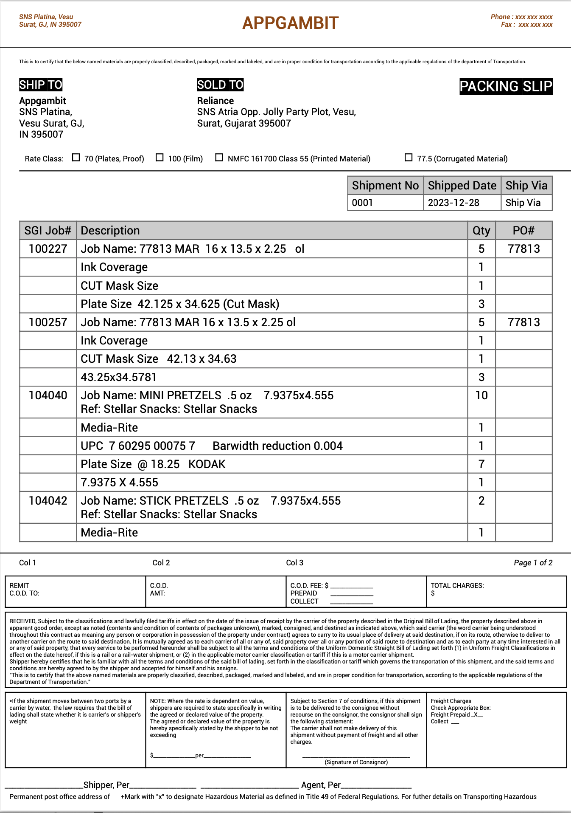

## PDFMake with NodeJS

Test scripts to generate PDFs with Node.js

## Node Version

v16.20.1

## Setup

```bash
npm i
node basic.js
node custom_document.js
node custom_style_fonts.js
node custom_tables.js
node basic_data.js
node basic_async.js
node complex_view.js
```

## Complex PDF Example

Please refer to the `complex_view.js` example to generate PDF like this.


